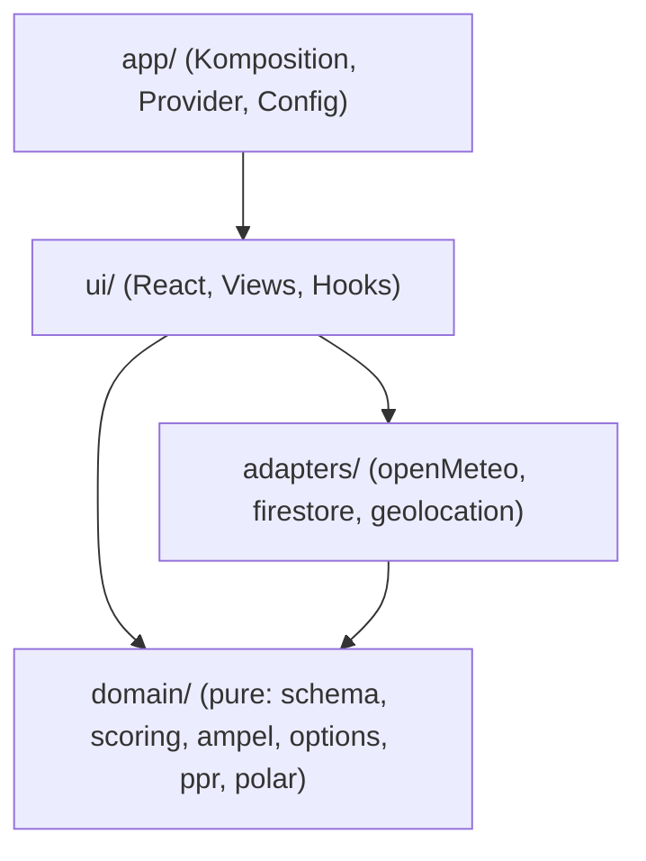
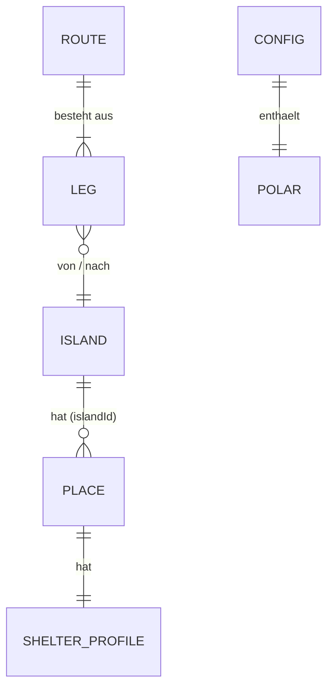
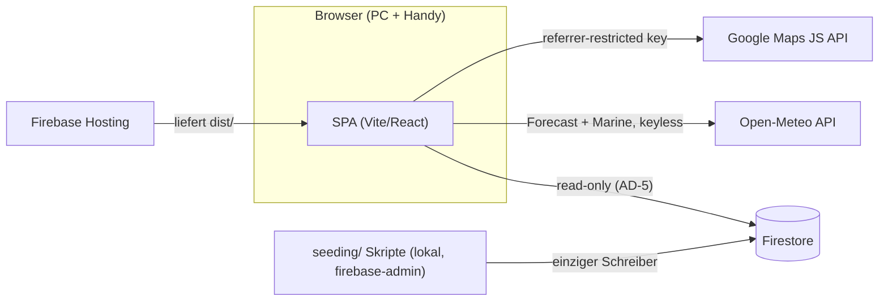

# Architecture Spine — sailgreece-router

## Design Paradigm

**Functional Core, Imperative Shell.** Die gesamte Domänenlogik — Etappen-Scoring,
Platz-Ampel, Optionsraum, Point of Return, Polar-Interpolation, Entscheidungspunkte —
lebt als pure TypeScript-Funktionen in `src/domain/` (kein I/O, kein React, kein
Firebase, keine Uhr). Die Schale besteht aus `src/adapters/` (Open-Meteo, Firestore,
Geolocation) und `src/ui/` (React); `src/app/` komponiert beides.



Abhängigkeitsrichtung ist Regel: `domain` importiert nichts aus den anderen Schichten;
`adapters` kennen nur `domain`-Typen; `ui` kennt beide; niemand importiert aus `app`.

## Invariants & Rules

### AD-1 — Client-only SPA, kein eigenes Backend `[ADOPTED]`

- **Binds:** all
- **Prevents:** API-Schichten/Cloud Functions, die für eine Ein-Nutzer-App nur
  Deployment- und Wartungsfläche schaffen.
- **Rule:** Die App läuft vollständig im Browser: Firestore Web SDK und Open-Meteo
  werden direkt aus dem Client aufgerufen. Es gibt keinen Server-Code; jede Anforderung,
  die scheinbar einen braucht, wird gegen NFR0 („Reduce it to the max") geprüft und
  sonst verworfen oder als Seeding-Skript gelöst.

### AD-2 — Pure Domain: Abhängigkeitsrichtung und Determinismus `[ADOPTED]`

- **Binds:** all
- **Prevents:** Domänenlogik (25-kn-Regel, Ampelbänder, PPR) verstreut in
  Komponenten/`useEffect`; nicht testbare, nicht reproduzierbare Bewertungen.
- **Rule:** `src/domain/` enthält ausschließlich pure, deterministische Funktionen:
  keine Imports aus `react`, `firebase`, `@vis.gl/*`, kein `fetch`, kein `Date.now()` —
  Zeit, Törntag und Position werden als Parameter injiziert. UI und Adapter berechnen
  nie Domänenwerte selbst; sie rufen den Core.

### AD-3 — Engine-Vertrag: ein Snapshot rein, ein Assessment raus

- **Binds:** F5, F6, F7 (FR15–FR22, FR26)
- **Prevents:** Teilberechnungen mit gemischten Forecast-Ständen; „gestern offen, heute
  geschlossen" wird unnachvollziehbar, wenn Bewertungen inkrementell aus verschiedenen
  Läufen stammen.
- **Rule:** Einziger Engine-Einstieg: `assessPlanning(snapshot: PlanningSnapshot):
  Assessment`. Der Snapshot enthält Bibliotheken, den vollständigen Forecast (je Ort ×
  Stunde, über den ganzen Resthorizont), Polare + Offset und den Törnkontext (Tag,
  Position, Rückgabe-Deadline). Jeder Forecast-Refresh erzeugt eine **vollständige
  Neuberechnung**; jedes Assessment trägt Modelllauf- und Abrufzeitstempel (FR13).
  Etappen an Törntag N+k werden gegen die Forecast-Werte **ihres künftigen
  Zeitfensters** bewertet, nie gegen den heutigen Wind (FR15).

### AD-4 — Ein Schema, zwei Konsumenten

- **Binds:** F2, F3, F8 (FR6–FR10, FR23–FR25)
- **Prevents:** Seeding-Skripte und App entwickeln unabhängig voneinander abweichende
  Datenformen (z. B. zwei Schutzprofil-Strukturen).
- **Rule:** Alle geteilten Datenformen (Insel, Platz, Schutzprofil, Route, Etappe,
  Polare, Config) sind **Zod-Schemas in `src/domain/schema/`** — die einzige Quelle.
  Seeding-Skripte importieren sie und validieren **strikt vor jedem Import**; die App
  parst beim Lesen tolerant (Fehler loggen, Dokument überspringen, nie stumm raten).
  Ein unkuratierter oder invalider Platz erhält keine grüne Ampel (NFR6).

### AD-5 — Firestore: flache Collections, ein Schreiber `[ADOPTED]`

- **Binds:** F2, F3, F8, NFR4
- **Prevents:** Zwei Owner derselben Entität; N-Queries über Subcollections für die
  Kartenansicht; App-Code, der Produktionsdaten mutiert.
- **Rule:** Top-Level-Collections `islands`, `places` (Feld `islandId`), `routes`,
  `config` (Dokumente `polar`, `parameters`). **Einziger Schreiber sind die
  Seeding-Skripte** (firebase-admin, lokal); die App ist strikt lesend. Security Rules:
  `read: true`, `write: false` für alles.

### AD-6 — Richtungs- und Einheiten-Semantik

- **Binds:** all (kritisch: F2 Schutzprofile ↔ F4 Forecast ↔ F5 Scoring)
- **Prevents:** Invertierte Schutzlogik (Sektor als „Wind weht hin" statt „Wind kommt
  aus" gelesen) — der gefährlichste stille Fehler des Systems.
- **Rule:** Wind- und Wellenrichtungen sind überall **„kommend aus"**, Grad
  rechtweisend 0–360 (Open-Meteo-Konvention). Schutzsektoren beschreiben Richtungen,
  **aus denen** der Platz geschützt ist. Distanzen in sm, Geschwindigkeiten in kn,
  Wellenhöhen in m, Winkel in Grad. Zeiten werden UTC/ISO-8601 gespeichert und
  ausschließlich in `Europe/Athens` angezeigt.

### AD-7 — Async-State nur über TanStack Query

- **Binds:** F1, F4, ui/adapters
- **Prevents:** Paralleles Fetch-/Cache-Gestrüpp (useEffect-Fetches, eigene
  Cache-Schichten) neben dem Query-Cache.
- **Rule:** Jeder asynchrone Datenzugriff (Open-Meteo, Firestore-Reads) läuft als
  TanStack-Query mit `staleTime` ≈ 1 h (= PRD-Cache-TTL, FR13). Kein zusätzlicher
  globaler State-Manager; der Törnkontext (Törntag, Position, gewählte Optionen) lebt
  in einem React-Context in `app/`.

### AD-8 — Betrieb: ein Projekt, klassisches Hosting `[ADOPTED]`

- **Binds:** NFR2, NFR4, Deployment
- **Prevents:** Multi-Env-Overhead und Fehlgriff zu Firebase App Hosting (zielt auf
  SSR-Frameworks, braucht Blaze).
- **Rule:** Ein GCP-/Firebase-Projekt (prod). Build `vite build` → Deploy von `dist/`
  via **klassischem Firebase Hosting** (`firebase deploy`, manuell, kein CI). Der
  Maps-Key wird per HTTP-Referrer-Restriction abgesichert und liegt als
  `VITE_`-Variable im Bundle (öffentlich by design). Tuning-Parameter (Polar-Offset,
  Schwellen, Zeitfenster) liegen im `config`-Dokument, nicht im Code — Feldkorrektur
  ohne Redeploy.

## Consistency Conventions

| Concern | Convention |
| --- | --- |
| IDs | Kebab-Case-Slugs, Insel-präfixiert für Plätze: `sifnos`, `sifnos-kamares`; Routen: `sued-route-naxos`. IDs sind stabil, nie umbenennen. |
| Dateien/Module | React-Komponenten `PascalCase.tsx`; alles andere `camelCase.ts`; Domain-Module nach Fachbegriff (`scoring.ts`, `ampel.ts`, `ppr.ts`, `polar.ts`, `options.ts`) |
| Inhaltssprache | Datenfelder und UI-Texte Deutsch (einziger Nutzer); Code, Bezeichner, Kommentare Englisch |
| Fehler | Adapter werfen typisierte Fehler → TanStack-Query-Error-States → sichtbarer Datenstand-/Fehlerhinweis in der UI (NFR5); der Core wirft nie für fachliche Zustände (Rot ist ein Ergebnis, kein Error) |
| Ampel-Werte | Ein gemeinsamer Typ `'gruen' \| 'gelb' \| 'rot'` aus `domain/schema` — überall derselbe, keine lokalen Farb-Enums |
| Config | Secrets/Keys via `VITE_`-Env; fachliche Parameter im Firestore-`config`-Dokument (AD-8) |
| Logging | `console` reicht (Solo-Tool); jede Assessment-Anzeige trägt Modelllauf + Abrufzeit (FR13) |

## Stack

| Name | Version |
| --- | --- |
| Vite | 8.x (8.2.0) |
| React | 19.x (19.2.8) |
| TypeScript | 5.9.x (bewusst nicht 7.0 — GA erst Juli 2026, Tooling reift) |
| Firebase JS SDK (modular) | 12.x |
| firebase-tools (CLI) | 15.x |
| @vis.gl/react-google-maps | 1.x (offizielle Google-Empfehlung; AdvancedMarker + Polyline nativ) |
| TanStack Query | 5.x |
| Zod | 4.x |
| Vitest | 4.x |
| firebase-admin (nur Seeding-Skripte) | aktuell (Node 22 LTS) |

*Versionen web-verifiziert am 2026-07-30; der Code besitzt sie ab `npm install`.*

## Structural Seed

```text
sailgreece-router/
  src/
    domain/          # pure core (AD-2)
      schema/        # Zod-Schemas = einzige Datenform-Quelle (AD-4)
      scoring.ts     # Etappen-Score (FR15/16), ampel.ts, options.ts, ppr.ts, polar.ts
    adapters/        # openMeteo.ts, firestore.ts, geolocation.ts
    ui/              # Views (Tagesansicht, Karte, Platz-Detail), Komponenten, Hooks
    app/             # main.tsx, Provider (QueryClient, TripContext), config
  seeding/           # Kurations-Staging (JSON je Insel) + Import-Skripte (firebase-admin)
  public/
  firebase.json      # Hosting → dist/
  firestore.rules    # read: true, write: false (AD-5)
```





## Capability → Architecture Map

| Capability / Area | Lives in | Governed by |
| --- | --- | --- |
| F1 Karte & Besprechungsbild (FR1–5) | `ui/` + `adapters/` (Maps) | AD-7, NFR1-Patterns (Addendum) |
| F2 Platzbibliothek (FR6–8) | `domain/schema` + Firestore `places` | AD-4, AD-5, AD-6 |
| F3 Routenbibliothek (FR9–10) | `domain/schema` + Firestore `routes` | AD-4, AD-5 |
| F4 Forecast (FR11–13) | `adapters/openMeteo.ts` | AD-3, AD-6, AD-7 |
| F5 Etappen-Scoring (FR15–17, FR26) | `domain/scoring.ts`, `polar.ts` | AD-2, AD-3, AD-6 |
| F6 Optionsraum & PPR (FR18–20, FR27) | `domain/options.ts`, `ppr.ts`; Position: `adapters/geolocation.ts` | AD-2, AD-3 |
| F7 Tagesentscheidung (FR21–22) | `ui/` (Tagesansicht) | AD-2 (UI rechnet nie selbst) |
| F8 Seeding & Kuration (FR23–25) | `seeding/` | AD-4, AD-5 |

## Deferred

- **Restplan-Suchalgorithmus** (wie FR18 „existiert ein zulässiger Restplan" konkret
  sucht — Graph über Rückfallketten, Tiefe, Abbruch): Implementierungsdetail innerhalb
  `domain/options.ts`; der Engine-Vertrag (AD-3) bleibt davon unberührt.
- **Gelb-Band-Reserve** (Wind-Reserve der Ampelbänder): per PRD-Annahme beim Bauen
  kalibrieren; landet als Parameter im `config`-Dokument (AD-8).
- **UI-Komponentenstruktur & Y.CO-Umsetzung** (Sticky-Split, Tageskarten, responsive
  Stapelung): UX-Phase / Umsetzung; Pattern-Extrakt liegt im PRD-Addendum.
- **Foto-Hosting** (URL-Feld vs. Firebase Storage): bei der Kuration entscheiden, wenn
  die Fotoquellen feststehen; das Schema trägt vorerst ein `photoUrl`-Feld.
- **CI/Automatisierung**: manuelles Deploy reicht für einen Nutzer und 9 Tage; erst bei
  Weiterentwicklung nach dem Törn neu bewerten.
- **Offline/PWA, Auth, Editier-UI**: per PRD out of scope; bewusst keine Vorkehrungen.
