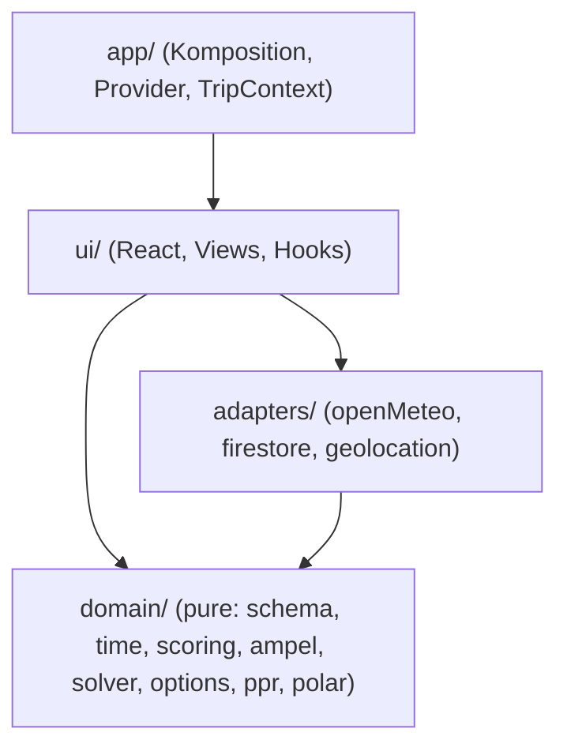
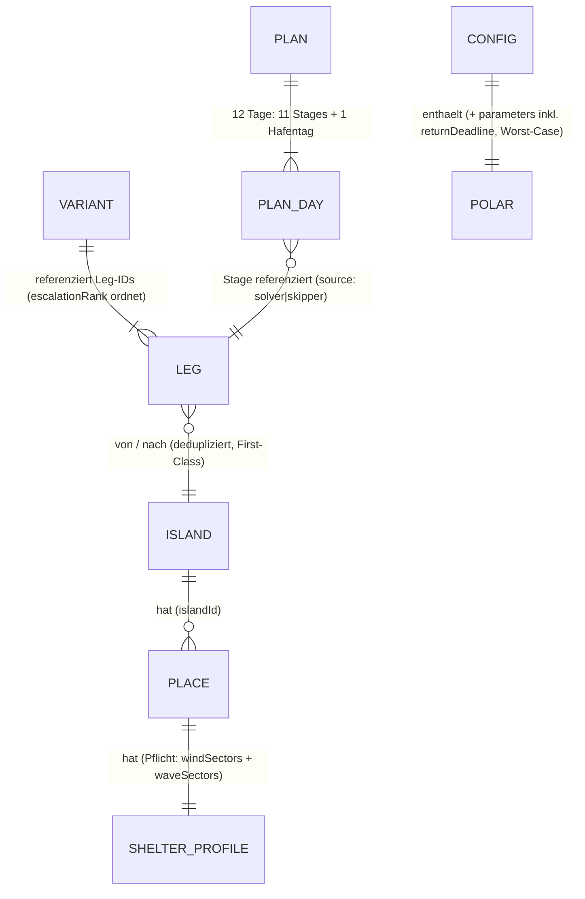
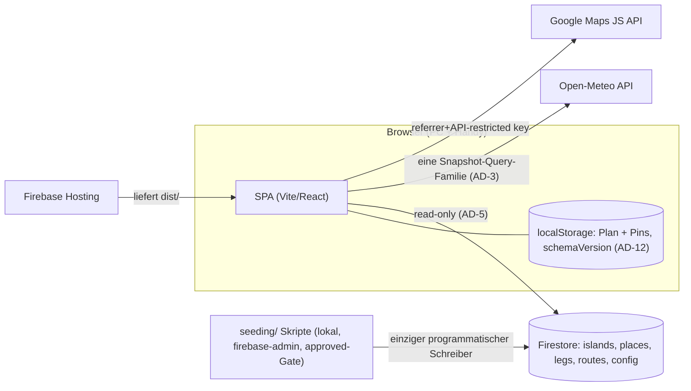

# Architecture Spine — sailgreece-router

*Revision 2 (2026-08-02): Round-Trip-Pivot aus dem Feldtest eingearbeitet — AD-3,
AD-4, AD-5, AD-6, AD-8, AD-11 amendiert; AD-12 (Plan-Modell) und AD-13
(Solver-Vertrag) neu. Brownfield: Der Bestandscode (One-Shot-MVP) hält AD-1 bis
AD-11 **in ihrer Revision-1-Fassung** nachweislich ein; die Rev-2-Amendments
(Plan statt `trackedRouteId`, `legs`-Collection, Solver) sind der gebundene Umbau.*

## Design Paradigm

**Functional Core, Imperative Shell.** Die gesamte Domänenlogik — Round-Trip-Solver,
Etappen-Scoring, Platz-Ampel, Rückkehrfenster, Point of Return, Polar-Interpolation,
Entscheidungspunkte — lebt als pure TypeScript-Funktionen in `src/domain/` (kein I/O,
kein React, kein Firebase, keine Uhr). Die Schale besteht aus `src/adapters/`
(Open-Meteo, Firestore, Geolocation) und `src/ui/` (React); `src/app/` komponiert
beides.



Abhängigkeitsrichtung ist Regel: `domain` importiert nichts aus den anderen Schichten;
`adapters` kennen nur `domain`-Typen; `ui` kennt beide; niemand importiert aus `app`.

## Invariants & Rules

### AD-1 — Client-only SPA, kein eigenes Backend `[ADOPTED]`

- **Binds:** all
- **Prevents:** API-Schichten/Cloud Functions, die für eine Ein-Nutzer-App nur
  Deployment- und Wartungsfläche schaffen.
- **Rule:** Die App läuft vollständig im Browser: Firestore Web SDK und Open-Meteo
  werden direkt aus dem Client aufgerufen. Es gibt keinen Server-Code; jede Anforderung,
  die scheinbar einen braucht, wird gegen NFR0 („Reduce it to the max") geprüft und
  sonst verworfen oder als Seeding-Skript gelöst.

### AD-2 — Pure Domain: Abhängigkeitsrichtung, Determinismus, Rangfolge ist Domäne `[ADOPTED]`

- **Binds:** all
- **Prevents:** Domänenlogik (25-kn-Regel, Ampelbänder, Solver-Relaxation) verstreut
  in Komponenten/`useEffect`; zwei Views, die denselben Fachwert verschieden
  „sortieren" oder nummerieren; ungetestete Sicherheitslogik unter Termindruck.
- **Rule:** `src/domain/` enthält ausschließlich pure, deterministische Funktionen:
  keine Imports aus `react`, `firebase`, `@vis.gl/*`, kein `fetch`, kein `Date.now()` —
  Zeit, Törntag und Position werden als Parameter injiziert. UI und Adapter berechnen
  nie Domänenwerte; **auch Auswahl, Rangfolge, Aggregation und Nummerierung über
  Fachwerte sind Domänenlogik** — der beste Platz einer Insel, der beste
  Pickup-Hafen und die Etappen-Nummer kommen aus der Domäne, nicht aus der View.
  Adapter mappen nur Formate, **nie Arithmetik oder fachliche Transformation**.
  `domain/ampel`, `domain/scoring`, `domain/polar` und der Solver (AD-13) tragen
  **Vitest-Fixtures mit Referenzfällen** (insbesondere AD-6-Sektorsemantik,
  Gültigkeits-Dreistufung und Relaxations-Reihenfolge); UI und Adapter bleiben
  testfrei.

### AD-3 — Engine-Vertrag: zwei benannte Einstiege, ein Machbarkeitsbegriff

- **Binds:** F1, F4, F5, F6, F7 (FR2, FR13, FR15–FR22, FR26, FR28–FR31)
- **Prevents:** Teilberechnungen mit gemischten Forecast-Ständen; zwei Fetch-Regimes
  auf derselben Karte; UI, die Dauer oder Ampeln „nachrechnet"; ein dritter,
  informeller Solver-Aufrufpfad.
- **Rule:** Der Core exportiert genau **zwei** Einstiege, beide pur und
  deterministisch, beide auf demselben Rechenpfad (`assessLeg`):
  `assessPlanning(snapshot: PlanningSnapshot): Assessment` (Bewertung) und
  `completePlan(snapshot, pins): Plan` (Solver-Vervollständigung, AD-12/AD-13).
  Der Vorschlag im Assessment ist **definiert als** `completePlan(snapshot,
  aktivePins)` — es gibt keinen zweiten Machbarkeitsbegriff. `snapshot.trip` trägt
  die persistierte Hauptroute samt Pins (AD-12).
  - **Ortsmenge normativ:** alle kuratierten Plätze **plus** die Wegpunkte der
    Leg-Bibliothek. **Eine** Query-Familie im TanStack-Cache; alle Views lesen aus
    diesem einen Snapshot — keine zweite Forecast-Query an der Engine vorbei.
  - Eine Etappe wird gegen Start-, Ziel- und Wegpunkt-Werte ihres Zeitfensters
    bewertet; **Etappen-Ampel = schlechtester Punkt.** Etappen an Törntag N+k werden
    gegen die Forecast-Werte **ihres künftigen Zeitfensters** bewertet, nie gegen den
    heutigen Wind (FR15). Den Umgang mit dem Forecast-Horizont regelt AD-13.
  - Tuning-Parameter erreichen den Snapshot **roh** (`snapshot.params`); Anwendung
    ausschließlich im Core (AD-10). Jeder Forecast-Refresh erzeugt eine
    **vollständige Neuberechnung**; jedes Assessment trägt Modelllauf- und
    Abrufzeitstempel (FR13).
  - Das Assessment enthält: die **Bewertung der Hauptroute** je Stage, die
    **Rest-Trip-Ampel** (unten), den **aktiven Vorschlag** (FR22 — das frühere
    Empfehlungsverbot ist per Feldtest-Entscheid aufgehoben), **Alternativen**,
    **Optionszustände** je Routen-Option (`offen | offen-horizont | schliesst am
    Tag X | zu` — die Basis der FR20-Entscheidungspunkte; die UI verdrahtet keine
    Kalender-Gates), Rückkehrfenster, Point of Return, Entscheidungspunkte sowie
    Platz-Ampeln und `bestPlace(insel, nachtN)`. Die UI blendet weiterhin nichts
    aus und entscheidet nichts.
  - **Rest-Trip-Ampel (FR2), abschließend definiert:** `gruen` = die Hauptroute ist
    **gültig** (AD-13) und alle ihre Stages liegen bewertbar im verlässlichen
    Horizont. `gelb` = die Hauptroute ist nicht als gültig nachweisbar — sie
    verletzt Bedingungen, hängt an Horizont-Stages oder enthält eine
    `unbewertet`e Stage (Datenlücke) —, aber das **Existenzprädikat** (AD-13) ist
    wahr. `rot` = das Existenzprädikat ist falsch (auch der am wenigsten
    verletzende Vorschlag verletzt); das FR18-Relaxationsverhalten greift.
  - **Berechnungsausweis (FR30):** Jede Dauer entsteht in genau **einem** Rechenpfad
    (`assessLeg` auf `scoring.ts`/`polar.ts` — Solver, PoR und Options konsumieren
    ihn gemeinsam) und liefert einen erklärbaren Breakdown: Segmente, Wind
    (Stärke/Richtung), TWA, Polar-Speed, Segel- vs. Motorzeit. Die UI rendert den
    Breakdown, rechnet aber nie nach.

### AD-4 — Ein Schema, zwei Konsumenten — und normative Kern-Formen

- **Binds:** F2, F3, F6, F8 (FR6–FR10, FR23–FR25, FR31)
- **Prevents:** Seeding und Engine entwickeln abweichende Datenformen; invertierte
  Nord-Sektoren; Bft-vs-kn-Mischung; vierfach kopierte Legs, die bei Korrekturen
  auseinanderlaufen; ein Pickup-Feld, dessen Fehlen als „erreichbar" gelesen wird.
- **Rule:** Alle geteilten Datenformen (Insel, Platz, Schutzprofil, **Leg**,
  **Routen-Variante**, **Plan/Stage**, Polare, Config) sind **Zod-Schemas in
  `src/domain/schema/`** — die einzige Quelle für App **und** Seeding. Normativ fixiert:
  - `ShelterProfile = { windSectors: Sector[], waveSectors: Sector[] }` —
    **getrennte** Sektorsätze; `Sector = { fromDeg, toDeg, maxKn }` (Welle: `maxM`),
    geschützt gegen Richtungen von `fromDeg` **im Uhrzeigersinn** bis `toDeg`,
    Wrap über 360→0 erlaubt, Grenzen inklusiv; kn/m — **Bft wird beim Seeding
    konvertiert, nie gespeichert.** Schutzprofil ist **Pflichtfeld** (NFR6);
    Plätze tragen optionale kuratierte `warnings[]` (z. B. Vlychada-Größenlimit).
  - **Legs sind First-Class und dedupliziert:** jede Etappe existiert genau einmal
    (ID `von--nach`, Distanz, Wegpunkte, `windWarnings`, `rebasedFrom?`).
    **Routen-Varianten** (Westkykladen-, Ostkykladen-Runde, Rückfallkette) sind
    geordnete **Leg-ID-Sequenzen** mit `escalationRank` — Etappen-Pool, kein starres
    Tagesraster; sie kopieren nie Leg-Inhalte. Die Saronische Alternative ist
    ersatzlos gestrichen und wird aus dem Seed entfernt.
  - `Plan = { schemaVersion, days: PlanDay[1..12] }`; `PlanDay` = Stage (`{ day,
    legId, toIslandId, toPlaceId?, source: 'solver' | 'skipper' }`) oder Hafentag.
    Details AD-12.
  - **Pickup-Fähigkeit (FR31)** ist ein Insel-Feld mit normativer Semantik:
    `pickup15Aug?: { ferryReachable: boolean, sourceNote: string }` — ein
    **fehlendes Feld gilt als NICHT erreichbar** (konservativ, nie stiller
    Optimismus); die konkreten Fährdaten liefert die Kuration.
  Seeding-Skripte validieren **strikt vor jedem Import**; die App parst beim Lesen
  tolerant — ein invalides Dokument wird geloggt und als `unbewertet` angezeigt,
  **nie stumm ausgeblendet, nie grün.** Schema-Änderungen sind breaking und laufen
  immer über beide Konsumenten.

### AD-5 — Firestore: flache Collections, ein programmatischer Schreiber

- **Binds:** F2, F3, F8, NFR4
- **Prevents:** Zwei Owner derselben Entität; N-Queries über Subcollections für die
  Kartenansicht; App-Code, der Produktionsdaten mutiert; stiller Drift zwischen
  Staging-JSON und DB nach Feldkorrekturen.
- **Rule:** Top-Level-Collections `islands`, `places` (Feld `islandId`), **`legs`**,
  `routes` (Varianten als Leg-ID-Sequenzen, AD-4), `config` (Dokumente `polar`,
  `parameters`). **Einziger programmatischer Schreiber sind die Seeding-Skripte**
  (firebase-admin, lokal); die App ist strikt lesend — der Plan (AD-12) liegt in
  `localStorage`, nie in Firestore. Security Rules: `read: true`, `write: false` für
  alles. Feldkorrekturen über die Firebase-Konsole sind als Notweg erlaubt — **müssen
  aber ins Staging-JSON zurückgetragen werden**, sonst überschreibt der nächste
  Import sie.

### AD-6 — Richtungs- und Einheiten-Semantik

- **Binds:** all (kritisch: F2 Schutzprofile ↔ F4 Forecast ↔ F5 Scoring ↔ F6 Solver)
- **Prevents:** Invertierte Schutzlogik; die Aufkreuz-Schwelle als „Winkel größer 65°"
  fehlgelesen — beides stille, gefährliche Vorzeichenfehler.
- **Rule:** Wind- und Wellenrichtungen sind überall **„kommend aus"**, Grad
  rechtweisend 0–360 (Open-Meteo-Konvention). Schutzsektoren beschreiben Richtungen,
  **aus denen** der Platz geschützt ist. Distanzen in sm, Geschwindigkeiten in kn,
  Wellenhöhen in m, Winkel in Grad. Zeiten werden UTC/ISO-8601 gespeichert und
  ausschließlich in `Europe/Athens` angezeigt; die Berechnungszeitbasis regelt AD-9.
  **Aufkreuz-Schwelle normativ als TWA-Prädikat:** ungültig ist jedes
  Etappen-Segment mit **TWA < 65° bei mittlerem Wind > 25 kn** („höher als 65° gegen
  den Wind" ist Seglersprache für *kleinere* TWA!); Böen zählen nicht gegen diese
  Schwelle `[ASSUMPTION: kalibrieren]`; bei ≤ 25 kn sind alle TWA zulässig — dann
  begrenzt nur das Tagesbudget. **Motor-Einsatzregel hat einen Owner:** ob ein
  Segment als Segel- oder Motorfahrt gerechnet wird, entscheidet ausschließlich
  `domain/scoring.ts` (Schwellwert im `config`-Dokument, AD-8); Segel- und
  Motorstunden werden getrennt geführt und getrennt gegen die FR16-Budgets
  (Ziel 5+1/6+0, hart 6+2) geprüft.

### AD-7 — Async-State nur über TanStack Query

- **Binds:** F1, F4, ui/adapters
- **Prevents:** Paralleles Fetch-/Cache-Gestrüpp (useEffect-Fetches, eigene
  Cache-Schichten) neben dem Query-Cache.
- **Rule:** Jeder asynchrone Datenzugriff (Open-Meteo, Firestore-Reads) läuft als
  TanStack-Query mit `staleTime` ≈ 1 h (= PRD-Cache-TTL, FR13). Forecast-Zugriff nur
  über die eine Snapshot-Query-Familie (AD-3). Kein zusätzlicher globaler
  State-Manager; den Törnkontext regelt AD-11/AD-12.

### AD-8 — Betrieb: ein Projekt, klassisches Hosting `[ADOPTED]`

- **Binds:** NFR2, NFR4, Deployment
- **Prevents:** Multi-Env-Overhead und Fehlgriff zu Firebase App Hosting (zielt auf
  SSR-Frameworks, braucht Blaze — web-verifiziert 2026-07-30, Memlog); Kalibrier-
  Werte, die einen Redeploy erzwingen; zwei Quellen für die Rückkehr-Deadline.
- **Rule:** Ein GCP-/Firebase-Projekt (prod). Build `vite build` → Deploy von `dist/`
  via **klassischem Firebase Hosting** (`firebase deploy`, manuell, kein CI). Der
  Maps-Key wird per HTTP-Referrer-**und** API-Restriction abgesichert und liegt als
  `VITE_`-Variable im Bundle (öffentlich by design). **Alle Tuning-Parameter liegen im
  `config`-Dokument, nicht im Code** — Polar-Offset (+0,5 kn), Motorfahrt
  (`motorSpeedKn` = 8) samt Motor-Einsatzschwelle (AD-6),
  Fallback-Pauschalgeschwindigkeiten, FR16-Schwellen und -Budgets, Zeitfenster,
  Gelb-Reserve, die Wettermodell-Wahl (`forecastModel`, Default ECMWF, FR11), und
  neu: **`returnDeadline`** als einziger Deadline-Zeitpunkt (19.8. 18:00 Athens
  `[ANNAHME: vertraglich bestätigen]` — die bisherigen Params
  `disembarkDay`/`bufferDays` werden daraus **abgeleitet**, nie parallel gepflegt),
  `reliableHorizonDays` (Default 7), das Meltemi-Worst-Case-Szenario,
  `pickupLatestArrival` (AD-13) und die Alternativen-Anzahl — Feldkorrektur ohne
  Redeploy.

### AD-9 — Zeitfenster sind Domänenobjekte

- **Binds:** F2, F5, F6, F7 (FR8, FR15, FR21, FR32)
- **Prevents:** UTC-vs-Athens-Verschiebung auf Rechenebene (±3 h macht Ampeln
  systematisch falsch); Karte und Tagesansicht zeigen für denselben Platz
  verschiedene Farben, weil „welche Nacht?" ungeklärt ist; Solver und PoR zählen
  Resttage verschieden.
- **Rule:** Alle fachlichen Zeitfenster sind in **Europe/Athens definiert** und werden
  von genau einer puren Funktion in `domain/time.ts` in UTC-Stundenindizes des
  Snapshots übersetzt (Snapshot-Stundenachse ist normativ UTC). Normativ:
  `nightWindow(N) = [Tag N 18:00, Tag N+1 09:00)` Athens; `legWindow(N) = [Tag N
  departureTime (Default 09:00), Ankunft)` Athens; **Nachtetappe** = Abfahrt nach
  18:00 oder Ankunft vor 09:00 Athens; Grenzen halb-offen. **Auch die
  Deadline-Ableitung ist eine einzige Funktion** in `domain/time.ts`: aus
  `returnDeadline` (AD-8) entstehen effektiver Deadline-Tag und PoR-Reserve —
  der Puffer-/Hafentag **ist** die PoR-Reserve; Solver und `ppr.ts` konsumieren
  dieselbe Funktion. **Jede Platz-Ampel ist eine Funktion `(platz, nachtN,
  snapshot)`** — es gibt keine „aktuelle" Ampel ohne Nacht-Parameter; die
  Karten-Marker (FR1) zeigen `nachtN = heutiger Törntag`, und zwar nur für aktuelle
  Insel und Ziel-Insel der heutigen Etappe. Der **Törntag wird pur aus dem
  injizierten `now` abgeleitet** (FR32, `deriveCurrentDay`) — kein manuelles
  Törntag-UI.

### AD-10 — Die Pipeline liefert Fakten, der Core liefert Urteile

- **Binds:** F5, F6, F8 (FR7, FR19, FR23–FR26)
- **Prevents:** Doppelt oder nie angewendeter Polar-Offset; Doppelkorrektur des
  Lavrion→Alimos-Rebasings; doppelt oder nie angewendete Lee/Luv-Regel;
  Rückfallhäfen-Kette mit zwei Ownern; ein Reimport, der persistierte Pläne
  unbemerkt bricht.
- **Rule:** `seeding/` normalisiert **Fakten** — Einheiten (Bft→kn), Schreibweisen,
  Distanz-Bezugspunkte (**in Firestore stehen ausschließlich fertig
  Alimos-normalisierte Distanzen**; Herkunft dokumentiert `rebasedFrom?`) — erfindet
  oder transformiert aber nie fachliche Bedeutung: gespeicherte Schutzsektoren sind
  ausschließlich quellenbasiert-statisch, nie geometrisch abgeleitet. Der
  M3-Kettenbruch der Westkykladen-Variante (Milos→Polyaigos) wird **beim Seeding
  aufgelöst**, nie im Core kaschiert. **Jede Regel, die Forecast oder Geometrie
  interpretiert, lebt ausschließlich in `domain/`:** die Lee/Luv-Regel in
  `domain/ampel.ts`; der Polar-Offset **einzig** in `domain/polar.ts`; der Core
  adjustiert Distanzen **nie**. Die Rückfallhäfen-Kette ist ein normatives
  Routen-Dokument mit fixer ID (`rueckfallkette-west`); `domain/ppr.ts` erhält sie
  über den Snapshot und enthält keine Orts- oder Distanzkonstanten. Der Import
  verlangt je Staging-Datei (**Inseln, Legs, Routen, Config**) eine **explizite
  Freigabe (`approved: true`)**, die nur Philipp nach der FR24-Review-Sicht setzt
  (generiertes Markdown in `seeding/review/`); ein Import, der **Leg-IDs
  entfernt**, listet sie in der Review-Sicht als **BREAKING** (persistierte Pläne
  referenzieren sie, AD-12); die Polare wird erst nach Verifikation gegen die
  Original-Exportdatei importiert.

### AD-11 — TripContext: ein Reducer, klare Präzedenz, kein View-State

- **Binds:** F1, F6, F7 (FR4, FR21, FR27, FR32), NFR2
- **Prevents:** GPS-Fix überschreibt die manuelle Positionswahl während der
  Crew-Besprechung; ein Karten-Hover ändert scheinbar den Plan; Reload am Handy
  vergisst die editierte Hauptroute; Abendcheck rechnet mit der Morgen-Position;
  ein Parse-Fehler, der als „kein Plan" durchgeht.
- **Rule:** Der Törnkontext — **die Hauptroute (Plan + Pins, AD-12)**, Position und
  Abfahrts-Override — wird ausschließlich über einen Reducer mit enumerierten
  Aktionen mutiert und nach jeder Änderung in `localStorage` persistiert
  (Reload-fest; Firestore bleibt lesend, AD-5). Der Plan trägt `schemaVersion`;
  beim Laden wird Zod-validiert — **ein Parse-Fehler ist der benannte Zustand
  `planUnreadable`, nie ein stiller Reset** (AD-12). `trackedRouteId` entfällt
  zugunsten des Plans. Position trägt `source: 'gps' | 'manual'`; GPS wird
  **einmalig beim App-Start ohne Button** geholt (FR27) und zusätzlich **bei jedem
  Forecast-Refresh still aktualisiert**; eine `manual`-Position wird von
  GPS-Updates **nie** überschrieben, bis der Nutzer sie explizit löst. Der Törntag
  kommt aus dem Datum (AD-9); der Day-Override bleibt als reiner Dev-/Test-Notweg
  ohne UI-Element `[ASSUMPTION]`. Transiente View-Zustände (Hover,
  Karten-Highlight, aktive Ansicht) sind lokaler UI-State und liegen **nicht** im
  TripContext. Navigation: **kein Router** — die Ansichten komponieren sich über
  UI-State (am PC Sticky-Split: Tagesliste **und** Karte gleichzeitig,
  FR4-Kopplung als transienter UI-State; am Handy gestapelt/gewechselt); URLs
  werden nicht geteilt (Solo-App, NFR0).

### AD-12 — Plan-Modell: Der Round-Trip ist persistierte Entität, der Solver überschreibt nie stumm

- **Binds:** F1, F6, F7 (FR2, FR18, FR21, FR22, FR28, FR29, FR31)
- **Prevents:** Eine Hauptroute, die bei jedem Forecast-Refresh stumm morpht (damit
  wäre FR2-Gelb per Definition unerreichbar und der Skipper verlöre die
  Entscheidungshoheit); zwei Owner des Plans oder der Platz-Ebene; zwei
  Mutationspfade (Reducer-intern vs. Effekt-dispatcht); ein Schema-Redeploy auf
  See, der alle Pins stumm verwirft.
- **Rule:** Der Round-Trip ist eine eigene Entität: `Plan = PlanDay[1..12]` — je
  Törntag genau eine **Stage** (Leg-Referenz, Ziel-Insel, optional gewählter Platz)
  oder ein **Hafentag** (genau einer; Default 15.8., der Gäste-Zustiegstag — der
  Solver darf ihn verschieben, wenn das Rückkehrfenster es erzwingt; das
  Pickup-Prädikat AD-13 bindet dann weiter an den Kalendertag 15.8.).
  Jeder `PlanDay` trägt `source: 'solver' | 'skipper'`.
  - **Die Hauptroute ist persistierter TripContext-State** (AD-11), nicht
    abgeleitet: Neuberechnungen **re-bewerten** sie nur (FR2) und erzeugen
    Vorschläge — sie mutieren sie nie. Bewertung und Vorschläge starten immer an
    der **tatsächlichen Position** (Snapshot), nie am Plan-Soll; weicht die
    Position vom Plan ab, wird die heutige Stage als abweichend markiert — der
    Plan bleibt unangetastet.
  - **Ein Mutationspfad:** Die Solver-Vervollständigung eines Edits berechnet die
    Schale **synchron beim Dispatch** über `completePlan(snapshot, pins)` (AD-3)
    aus dem aktuellen Snapshot und übergibt den fertigen Plan als Payload **einer**
    atomaren Aktion — Pin und Vervollständigung stammen aus demselben Snapshot;
    der Reducer rechnet nie, und **kein Effekt dispatcht planverändernde Aktionen
    als Reaktion auf ein Assessment** (einzige Ausnahme: `ADOPT_INITIAL`).
  - Mutations-Aktionen: **Etappen-Edit** (FR28) setzt den Tag auf
    `source: 'skipper'` (Pin — Ziel-Insel und/oder Platz; auch das **Verschieben
    des Hafentags**, z. B. auf heute: „wir bleiben") und ersetzt alle ungepinnten
    Folgetage; **Check-in** (FR29) übernimmt einen Vorschlag oder eine Alternative
    als neue Hauptroute und löst dabei alle Pins; **`ADOPT_INITIAL`** adoptiert
    den Solver-Vorschlag genau einmal — beim ersten erfolgreichen Assessment, wenn
    **noch nie** ein Plan persistiert wurde (`null`, **nicht** „invalid").
  - **`planUnreadable`:** Ein unparsebarer persistierter Plan ist ein sichtbarer
    Zustand, nie „kein Plan" — die Adoption des Solver-Vorschlags erfordert dann
    eine explizite Bestätigung (Check-in-Semantik).
  - **Tote Leg-Referenzen** (nach Reimport): die Stage wird `unbewertet`, gilt
    nicht als Pin, der Plan bleibt bestehen (Rest-Trip-Ampel: Gelb-Klausel, AD-3);
    der Skipper repariert per Edit.
  - **Platz-Ebene:** `toPlaceId` ist **ausschließlich Skipper-gesetzt**;
    Solver-Stages tragen nie einen Platz. Leere Stages zeigt die UI normativ als
    `bestPlace(insel, nachtN)` aus dem **aktuellen** Assessment, gekennzeichnet
    als Vorschlag — das Morphen ist deklariert, nicht stumm. Ein Skipper-Platz mit
    roter Nacht-Ampel berührt die Plan-Gültigkeit **nicht** (die drei
    Ampel-Ebenen FR8/FR17/FR2 bleiben getrennt); die rote Platz-Ampel selbst
    bleibt am Tag sichtbar.
  - **Etappen-Nummer ist Domänenfunktion:** `stageNumber(plan, day): number | null`
    (null am Hafentag) — Ordinalzahl über Stages in Tagesreihenfolge 1–11,
    unabhängig von der Hafentag-Position; Views zeigen Etappen-Nummer und Törntag
    als Paar, keine View zählt selbst.
  - Gepinnte Tage sind **harte Constraints des Solvers** (für Vorschlag und
    Vervollständigung) und werden nur durch explizites Lösen oder Check-in wieder
    frei; vergangene Tage (Törntag < heute) sind implizit fixiert.

### AD-13 — Solver-Vertrag: Gültigkeit dreistufig, Relaxation und Existenzprädikat im Core

- **Binds:** F5, F6, F7 (FR16–FR20, FR28–FR31)
- **Prevents:** Ein Solver, der „irgendwas Plausibles" liefert und im Meltemi-Moment
  stumm bleibt; Relaxation als UI-Verhalten; die Fenster-Strategie als unverbindliche
  Dekoration **oder** als Dauer-Rot-Übersteuerung — beide Fehllesarten; vier
  verschiedene FR2-Gelb-Prädikate; Scheingenauigkeit jenseits des Horizonts.
- **Rule:** Der Solver ist eine pure, **deterministische** Funktion (stabile
  Tie-Breaks) hinter den zwei Einstiegen aus AD-3 und erweitert den vorhandenen
  `packLegsFeasible`-Kern (DP über Etappe × Tag) von Boolean-Feasibility auf
  Plan-Rückgabe; er sucht ausschließlich über die Leg-Bibliothek entlang der
  Routen-Varianten (FR9) und respektiert Pins (AD-12). Vollständige Neuberechnung
  je Refresh.
  - **Gültigkeit, dreistufig normativ (FR18/FR19):**
    (1) Jede Stage **innerhalb des verlässlichen Horizonts**
    (`reliableHorizonDays`, config, Default 7 `[ANNAHME]`) hält die
    FR16-Schwellen gegen den echten Forecast (Dauer aus Polare + Offset,
    Aufkreuz-Prädikat AD-6). Stages **jenseits** des Horizonts sind `unbewertet`
    und zählen **nie** für oder gegen die Gültigkeit (FR18 wörtlich) — sie
    erzeugen höchstens FR2-Gelb („hängt am Horizont").
    (2) Ankunft Alimos ≤ `returnDeadline` (die **eine** Konstante, AD-8/AD-9).
    (2′) **Rückkehr-Check, bindend:** Von jedem Plan-Tag aus ist die Rückkehr
    nach Alimos über die Rückfallhäfen-Kette in den Resttagen fahrbar, wobei
    Stunden jenseits des Horizonts gegen das **Meltemi-Worst-Case-Szenario**
    gerechnet werden (config-Objekt: 30 kn aus 0–45°, Welle 2,0 m aus N
    `[ANNAHME: kalibrieren]`). Dieser Check ist **identisch** mit der
    PoR-Rechnung (`ppr.ts`, dieselbe Funktion) — die Meltemi-Sicherheit des
    Fensterende-Hafens ist Bestandteil von (2′), nie separater Score. Das
    Worst-Case-Szenario bindet **genau diese eine Rechnung** — nie die
    Hin-Stages.
    (3) **Pickup-Prädikat (FR31), an den Kalendertag 15.8. gebunden** (nicht an
    den verschiebbaren Hafentag): Das Boot liegt am 15.8. an einem Platz einer
    Insel mit `pickup15Aug.ferryReachable` (AD-4) — d. h. die Anreise-Stage endet
    dort spätestens mit `nightWindow` des 14.8., **oder** die Etappe des 15.8.
    endet dort vor `pickupLatestArrival` (config, Default 16:00 Athens
    `[ANNAHME: mit Fährzeiten kalibrieren]`).
  - **Rückkehrfenster (FR19):** Die Engine erkennt Fenster im Horizont (Zeiträume,
    in denen die Rückkehr-Etappen FR16 einhalten) und plant deren Nutzung ein;
    ohne Fenster wird konservativ geplant — beides folgt aus (2′), keine eigene
    Regel. Die 2/3-Faustregel ist Heuristik-Narrativ, keine Rechenregel.
  - **Kein gültiger Plan:** Der Solver liefert den **am wenigsten verletzenden**
    Vorschlag mit benannter verletzter Bedingung; Relaxations-Reihenfolge fix im
    Core: Ziel-Budget → hartes Maximum → Nachtetappen-Option — **nie** die
    65°/25-kn-Schwelle, **nie** das Pickup-Prädikat. Rest-Trip-Ampel dann `rot`.
  - **FR2-Existenzprädikat (für Gelb vs. Rot):** „Ein gültiger Round-Trip
    existiert" = der DP-Lauf findet **irgendeinen** gültigen Plan im vollen
    Suchraum, wobei vergangene Tage fixiert sind, aktive **Pins aber NICHT
    binden** (der Einlöseweg ist der Check-in, und der löst Pins). Der
    Existenz-Check ist Nebenprodukt desselben DP-Laufs — keine zweite
    Machbarkeitsrechnung. **Invariante:** Ist das Prädikat wahr, enthält die
    Alternativen-Menge (FR29) mindestens einen gültigen Plan (den
    Existenzzeugen) — Gelb ist immer einlösbar.
  - **Zielfunktion:** Gültigkeit vor Präferenz; das Süd-Wunschbild
    (Santorin/Amorgos) und der Pickup direkt auf Santorin sind **weiche
    Präferenzen im Score, nie Constraints**.
  - **Nachtetappen:** Definition per AD-9; Wind-Check < 10 kn über die **gesamte**
    Etappendauer; zählt nicht gegen das Tagesbudget, der Folgetag wird auf das
    Ziel-Budget begrenzt `[ASSUMPTION]`; der Solver schlägt sie nur vor, wenn ohne
    sie kein gültiger Plan für Nord-Rückkehr bzw. Santorin/Amorgos existiert;
    max. 2, nur zweite Woche.
  - **Alternativen (FR29):** max. 2–3, davon mindestens eine konservativere
    Eskalationsstufe und — falls offen — eine ambitioniertere Süd-Option
    `[ASSUMPTION]`; enthält immer den Existenzzeugen (oben).

## Consistency Conventions

| Concern | Convention |
| --- | --- |
| IDs | Kebab-Case-Slugs, Insel-präfixiert für Plätze: `sifnos`, `sifnos-kamares`; Legs: `paros--naxos`; Varianten: `westkykladen-runde`. IDs sind stabil, nie umbenennen; Löschungen sind BREAKING (AD-10). |
| Dateien/Module | React-Komponenten `PascalCase.tsx`; alles andere `camelCase.ts`; Domain-Module nach Fachbegriff (`time.ts`, `scoring.ts`, `ampel.ts`, `solver.ts`, `ppr.ts`, `polar.ts`, `options.ts`) |
| Inhaltssprache | Datenfelder und UI-Texte Deutsch (einziger Nutzer); Code, Bezeichner, Kommentare Englisch |
| Fehler | Adapter werfen typisierte Fehler → TanStack-Query-Error-States → sichtbarer Datenstand-/Fehlerhinweis in der UI (NFR5); der Core wirft nie für fachliche Zustände (Rot, `unbewertet`, `planUnreadable` und „kein gültiger Plan" sind Ergebnisse, keine Errors) |
| Ampel-Werte | Ein gemeinsamer Typ `'gruen' \| 'gelb' \| 'rot' \| 'unbewertet'` aus `domain/schema` — überall derselbe, auf allen drei Ebenen (Platz FR8, Etappe/Option FR17, Rest-Trip FR2); `unbewertet` (grau) für fehlende Daten/Horizont/Parse-Fehler, nie grün, nie stummes Ausblenden |
| Pflicht-UI-Hinweise | Permanent sichtbar: NFR3-Hinweis („ersetzt nicht das seemännische Urteil") und Datenstand (Modelllauf + Abrufzeit, FR13); Footer-Attribution „Weather data by Open-Meteo (CC BY 4.0)", CruisersWiki-Attribution in der Platz-Detailansicht |
| Config | Secrets/Keys via `VITE_`-Env; fachliche Parameter im Firestore-`config`-Dokument (AD-8) |
| Logging | `console` reicht (Solo-Tool) |

## Stack

Der Stack ist gebaut und wird vom Code besessen (`package.json` ist die Quelle);
installiert und gegen das Repo bestätigt am 2026-08-02 (Web-Verifikation der
Auswahl: 2026-07-30, Memlog):

| Name | Version (installiert) |
| --- | --- |
| Vite | 8.2.0 |
| React | 19.2.8 |
| TypeScript | 5.9.3 (bewusst nicht 7.0) |
| Firebase JS SDK (modular) | 12.16.0 |
| @vis.gl/react-google-maps | 1.9.0 — AdvancedMarker nativ; Polyline als kopierte visgl-Beispielkomponente, gestrichelte Linien via Symbol-`repeat` |
| TanStack Query | 5.101.4 |
| Zod | 4.4.3 |
| Vitest | 4.1.10 |
| Styling | Vanilla CSS + Custom Properties (`src/ui/styles.css`) |
| firebase-admin (nur Seeding) | 14.2.0, Node ≥ 22.18 |

## Structural Seed

Der Baum existiert; die Umbau-Punkte des Pivots sind markiert:

```text
sailgreece-router/
  src/
    domain/          # pure core (AD-2, AD-10)
      schema/        # Zod-Schemas = einzige Datenform-Quelle (AD-4) — NEU: leg, variant, plan
      time.ts        # Zeitfenster + Deadline-Ableitung → UTC-Indizes (AD-9)
      solver.ts      # NEU: completePlan + Existenzprädikat (AD-13), erweitert packLegsFeasible (ppr.ts)
      scoring.ts     # assessLeg mit Breakdown (FR30) + Motor-Einsatzregel (AD-6); ampel.ts, options.ts, ppr.ts, polar.ts, assess.ts
    adapters/        # openMeteo.ts, firestore.ts (+ legs), geolocation.ts
    ui/              # Views: DayView (editierbare Etappen-Cards), MapView (Round-Trip-Overlay), PlaceDetailView
    app/             # main.tsx, App.tsx, tripContext.tsx (Plan+Pins, AD-12), planningContext, usePlanning
  seeding/           # Staging-JSON je Insel + legs/varianten (approved-Gate, AD-10) + Import-Skripte
    review/          # generierte FR24-Review-Sichten (Markdown; BREAKING-Liste bei Leg-Löschung)
  firebase.json      # Hosting → dist/
  firestore.rules    # read: true, write: false (AD-5)
```





## Capability → Architecture Map

| Capability / Area | Lives in | Governed by |
| --- | --- | --- |
| F1 Karte & Round-Trip-Overlay (FR1–5) | `ui/MapView` + `adapters/` (Maps) | AD-3 (Rest-Trip-Ampel), AD-7, AD-9, AD-11, AD-12 |
| F2 Platzbibliothek (FR6–8) | `domain/schema` + Firestore `places` | AD-4, AD-5, AD-6, AD-9 |
| F3 Routenbibliothek: Legs + Varianten (FR9–10) | `domain/schema` + Firestore `legs`/`routes` | AD-4, AD-5, AD-10 |
| F4 Forecast (FR11–13) | `adapters/openMeteo.ts` | AD-3, AD-6, AD-7, AD-8 (`forecastModel`) |
| F5 Etappen-Scoring + Berechnungsausweis (FR15–17, FR26, FR30) | `domain/scoring.ts`, `polar.ts` | AD-2, AD-3, AD-6, AD-9, AD-10 |
| F6 Round-Trip, Rückkehrfenster & PoR (FR18–20, FR27, FR31, FR32) | `domain/solver.ts`, `options.ts`, `ppr.ts`; Position: `adapters/geolocation.ts` | AD-2, AD-3, AD-10, AD-11, AD-12, AD-13 |
| F7 Tagesentscheidung & Etappen-Editing (FR21–22, FR28–29) | `ui/DayView` + `app/tripContext` | AD-2, AD-3, AD-9, AD-12 |
| F8 Seeding & Kuration (FR23–25) | `seeding/` | AD-4, AD-5, AD-10 |

## Deferred

- **Solver-Interna** (Suchreihenfolge im DP, Pruning, Tie-Break-Details,
  Score-Gewichte der Süd-Präferenz): Implementierungsdetail innerhalb
  `domain/solver.ts`; Vertrag (AD-13) und der eine Machbarkeitsbegriff bleiben
  davon unberührt.
- **Konkrete Hafenfolge der `rueckfallkette-west`** (mit Alimos-rebasten
  Distanzen): sicherheitsrelevanter Seed-Inhalt wie die Schutzprofile — bei der
  Kuration recherchieren, in der FR24-Review-Sicht mit Priorität prüfen (M5).
- **Fähren-Daten für FR31** (welche Inseln am 15.8. ab Santorin erreichbar sind,
  Kalibrierung von `pickupLatestArrival`): bei der Kuration recherchieren; die
  Datenform ist normiert (AD-4), fehlend = nicht erreichbar.
- **Hafentag-UX** (was die Tagesansicht an einem Hafentag zeigt): UX-Entscheid bei
  der Umsetzung; das Plan-Modell (AD-12) trägt den Hafentag bereits.
- **Kalibrier-Werte** (Gelb-Band-Reserve, Worst-Case-Szenario, Horizont-Tage,
  Motor-Einsatzschwelle, Nachtetappen-Folgetag-Regel, Böen-Behandlung): beim
  Bauen/auf dem Törn kalibrieren; alle Werte im `config`-Dokument (AD-8).
- **Foto-Hosting** (URL-Feld vs. Firebase Storage): bei der Kuration entscheiden;
  das Schema trägt `photoUrl`.
- **CI/Automatisierung**: manuelles Deploy reicht; erst nach dem Törn neu bewerten.
- **Offline/PWA, Auth, Editier-UI für Bibliotheken**: per PRD out of scope.
