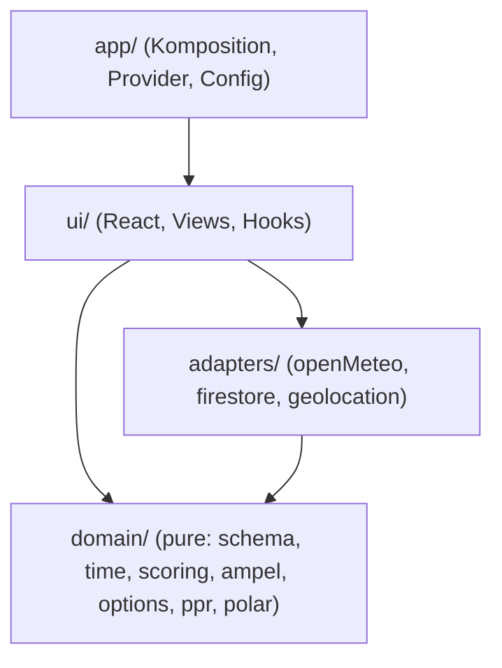
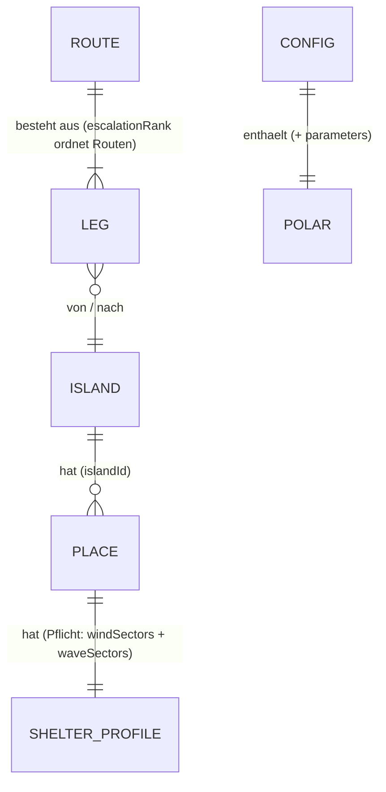
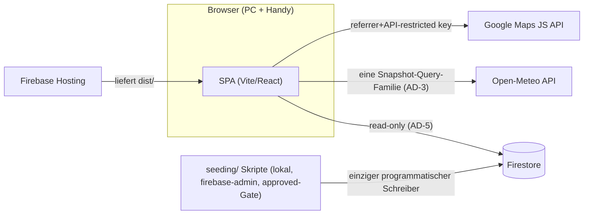

# Architecture Spine — sailgreece-router

## Design Paradigm

**Functional Core, Imperative Shell.** Die gesamte Domänenlogik — Etappen-Scoring,
Platz-Ampel, Optionsraum, Point of Return, Polar-Interpolation, Entscheidungspunkte —
lebt als pure TypeScript-Funktionen in `src/domain/` (kein I/O, kein React, kein
Firebase, keine Uhr). Die Schale besteht aus `src/adapters/` (Open-Meteo, Firestore,
Geolocation) und `src/ui/` (React); `src/app/` komponiert beides.



Abhängigkeitsrichtung ist Regel: `domain` importiert nichts aus den anderen Schichten;
`adapters` kennen nur `domain`-Typen; `ui` kennt beide; niemand importiert aus `app`.

## Invariants & Rules

### AD-1 — Client-only SPA, kein eigenes Backend `[ADOPTED]`

- **Binds:** all
- **Prevents:** API-Schichten/Cloud Functions, die für eine Ein-Nutzer-App nur
  Deployment- und Wartungsfläche schaffen.
- **Rule:** Die App läuft vollständig im Browser: Firestore Web SDK und Open-Meteo
  werden direkt aus dem Client aufgerufen. Es gibt keinen Server-Code; jede Anforderung,
  die scheinbar einen braucht, wird gegen NFR0 („Reduce it to the max") geprüft und
  sonst verworfen oder als Seeding-Skript gelöst.

### AD-2 — Pure Domain: Abhängigkeitsrichtung, Determinismus, Rangfolge ist Domäne `[ADOPTED]`

- **Binds:** all
- **Prevents:** Domänenlogik (25-kn-Regel, Ampelbänder, PPR) verstreut in
  Komponenten/`useEffect`; zwei Views, die denselben Fachwert verschieden „sortieren";
  ungetestete Sicherheitslogik unter Termindruck.
- **Rule:** `src/domain/` enthält ausschließlich pure, deterministische Funktionen:
  keine Imports aus `react`, `firebase`, `@vis.gl/*`, kein `fetch`, kein `Date.now()` —
  Zeit, Törntag und Position werden als Parameter injiziert. UI und Adapter berechnen
  nie Domänenwerte; **auch Auswahl, Rangfolge und Aggregation über Fachwerte sind
  Domänenlogik** („Sortieren nach Fachkriterien ist Berechnen" — der beste Platz einer
  Insel kommt aus dem Assessment, nicht aus der View). Adapter mappen nur Formate,
  **nie Arithmetik oder fachliche Transformation**. `domain/ampel`, `domain/scoring`
  und `domain/polar` tragen **Vitest-Fixtures mit Referenzfällen** (insbesondere
  AD-6-Sektorsemantik: „Meltemi aus N, Bucht nach S offen ⇒ grün; nach N offen ⇒
  rot"); UI und Adapter bleiben testfrei.

### AD-3 — Engine-Vertrag: ein Snapshot rein, ein Assessment raus

- **Binds:** F1, F4, F5, F6, F7 (FR15–FR22, FR26)
- **Prevents:** Teilberechnungen mit gemischten Forecast-Ständen; zwei Fetch-Regimes
  (Routen-Wegpunkte vs. Karten-Plätze) mit verschiedenen Modellläufen auf derselben
  Karte; Empfehlung/Ausblenden durch die UI.
- **Rule:** Einziger Engine-Einstieg: `assessPlanning(snapshot: PlanningSnapshot):
  Assessment`.
  - **Ortsmenge normativ:** alle kuratierten Plätze (Schlüssel = Platz-ID) **plus**
    die in der Routenbibliothek hinterlegten Etappen-Wegpunkte (Schlüssel =
    Etappen-ID). **Eine** Query-Familie im TanStack-Cache; alle Views lesen aus
    diesem einen Snapshot — keine zweite Forecast-Query an der Engine vorbei.
  - Eine Etappe wird gegen Start-, Ziel- und Wegpunkt-Werte ihres Zeitfensters
    bewertet; **Etappen-Ampel = schlechtester Punkt.**
  - Stunden jenseits des verfügbaren Modell-Horizonts (Marine < Wetter!) stehen im
    Snapshot als `null`; der Core bewertet sie als **`unbewertet`** (nie grün, nie
    rot); ein Options-Zustand jenseits des Horizonts heißt „offen (Horizont)" mit
    sichtbarem Vorbehalt.
  - Tuning-Parameter erreichen den Snapshot **roh** (`snapshot.params`); Anwendung
    ausschließlich im Core (AD-10).
  - Jeder Forecast-Refresh erzeugt eine **vollständige Neuberechnung**; jedes
    Assessment trägt Modelllauf- und Abrufzeitstempel (FR13). Etappen an Törntag N+k
    werden gegen die Forecast-Werte **ihres künftigen Zeitfensters** bewertet, nie
    gegen den heutigen Wind (FR15).
  - Das Assessment enthält Bewertungen, Zustände und Rangfolgen (u. a.
    `bestPlace(insel, nachtN)`), aber **kein Empfehlungsfeld** für Routen-Optionen;
    die UI blendet keine Option aus (FR22). `options.ts` und `ppr.ts` konsumieren
    **dieselbe** Etappen-Dauerfunktion aus `scoring.ts`/`polar.ts` — es gibt nur einen
    Machbarkeitsbegriff.

### AD-4 — Ein Schema, zwei Konsumenten — und normative Kern-Formen

- **Binds:** F2, F3, F8 (FR6–FR10, FR23–FR25)
- **Prevents:** Seeding und Engine entwickeln abweichende Datenformen; invertierte
  Nord-Sektoren; Bft-vs-kn-Mischung; ein Sektorsatz für Wind und Welle.
- **Rule:** Alle geteilten Datenformen (Insel, Platz, Schutzprofil, Route, Etappe,
  Polare, Config) sind **Zod-Schemas in `src/domain/schema/`** — die einzige Quelle.
  Die Schemas entstehen in **einer** Schema-First-Story vor Seeding und Engine;
  danach sind Änderungen breaking und laufen über beide Konsumenten. Normativ fixiert:
  - `ShelterProfile = { windSectors: Sector[], waveSectors: Sector[] }` —
    **getrennte** Sektorsätze für Wind und Welle.
  - `Sector = { fromDeg, toDeg, maxKn }` (Welle: `maxM`). Semantik: geschützt gegen
    Richtungen von `fromDeg` **im Uhrzeigersinn** bis `toDeg`, **Wrap über 360→0
    erlaubt** (`330–60` = Nord-Sektor), Grenzen inklusiv. Stärkegrenzen in kn bzw. m —
    **Bft wird beim Seeding konvertiert, nie gespeichert.**
  - Das Schutzprofil ist **Pflichtfeld** des Platzes: Unkuratiertes kommt nicht durch
    den Import (NFR6). Routen tragen ein Ordnungsfeld `escalationRank` (FR9
    Eskalationsstufen).
  Seeding-Skripte validieren **strikt vor jedem Import**; die App parst beim Lesen
  tolerant — ein invalides Dokument wird geloggt und als `unbewertet` angezeigt,
  **nie stumm ausgeblendet, nie grün.**

### AD-5 — Firestore: flache Collections, ein programmatischer Schreiber `[ADOPTED]`

- **Binds:** F2, F3, F8, NFR4
- **Prevents:** Zwei Owner derselben Entität; N-Queries über Subcollections für die
  Kartenansicht; App-Code, der Produktionsdaten mutiert; stiller Drift zwischen
  Staging-JSON und DB nach Feldkorrekturen.
- **Rule:** Top-Level-Collections `islands`, `places` (Feld `islandId`), `routes`,
  `config` (Dokumente `polar`, `parameters`). **Einziger programmatischer Schreiber
  sind die Seeding-Skripte** (firebase-admin, lokal); die App ist strikt lesend.
  Security Rules: `read: true`, `write: false` für alles. Feldkorrekturen über die
  Firebase-Konsole sind als Notweg erlaubt — **müssen aber ins Staging-JSON
  zurückgetragen werden**, sonst überschreibt der nächste Import sie.

### AD-6 — Richtungs- und Einheiten-Semantik

- **Binds:** all (kritisch: F2 Schutzprofile ↔ F4 Forecast ↔ F5 Scoring)
- **Prevents:** Invertierte Schutzlogik (Sektor als „Wind weht hin" statt „Wind kommt
  aus" gelesen) — der gefährlichste stille Fehler des Systems.
- **Rule:** Wind- und Wellenrichtungen sind überall **„kommend aus"**, Grad
  rechtweisend 0–360 (Open-Meteo-Konvention). Schutzsektoren beschreiben Richtungen,
  **aus denen** der Platz geschützt ist. Distanzen in sm, Geschwindigkeiten in kn,
  Wellenhöhen in m, Winkel in Grad. Zeiten werden UTC/ISO-8601 gespeichert und
  ausschließlich in `Europe/Athens` angezeigt; die Berechnungszeitbasis regelt AD-9.

### AD-7 — Async-State nur über TanStack Query

- **Binds:** F1, F4, ui/adapters
- **Prevents:** Paralleles Fetch-/Cache-Gestrüpp (useEffect-Fetches, eigene
  Cache-Schichten) neben dem Query-Cache.
- **Rule:** Jeder asynchrone Datenzugriff (Open-Meteo, Firestore-Reads) läuft als
  TanStack-Query mit `staleTime` ≈ 1 h (= PRD-Cache-TTL, FR13). Forecast-Zugriff nur
  über die eine Snapshot-Query-Familie (AD-3). Kein zusätzlicher globaler
  State-Manager; den Törnkontext regelt AD-11.

### AD-8 — Betrieb: ein Projekt, klassisches Hosting `[ADOPTED]`

- **Binds:** NFR2, NFR4, Deployment
- **Prevents:** Multi-Env-Overhead und Fehlgriff zu Firebase App Hosting (zielt auf
  SSR-Frameworks, braucht Blaze).
- **Rule:** Ein GCP-/Firebase-Projekt (prod). Build `vite build` → Deploy von `dist/`
  via **klassischem Firebase Hosting** (`firebase deploy`, manuell, kein CI). Der
  Maps-Key wird per HTTP-Referrer-**und** API-Restriction abgesichert und liegt als
  `VITE_`-Variable im Bundle (öffentlich by design). **Alle Tuning-Parameter liegen im
  `config`-Dokument, nicht im Code** — Polar-Offset (+0,5 kn), Motorfahrt
  (`motorSpeedKn` = 8), Fallback-Pauschalgeschwindigkeiten (6,0/7,5/6,5 kn, aktiv nur
  ohne geladene Polare), FR16-Schwellen und -Budgets, Zeitfenster, Gelb-Reserve —
  Feldkorrektur ohne Redeploy.

### AD-9 — Zeitfenster sind Domänenobjekte

- **Binds:** F2, F5, F6, F7 (FR8, FR15, FR21)
- **Prevents:** UTC-vs-Athens-Verschiebung auf Rechenebene (±3 h macht Ampeln
  systematisch falsch); Karte und Tagesansicht zeigen für denselben Platz
  verschiedene Farben, weil „welche Nacht?" ungeklärt ist.
- **Rule:** Alle fachlichen Zeitfenster sind in **Europe/Athens definiert** und werden
  von genau einer puren Funktion in `domain/time.ts` in UTC-Stundenindizes des
  Snapshots übersetzt (Snapshot-Stundenachse ist normativ UTC). Normativ:
  `nightWindow(N) = [Tag N 18:00, Tag N+1 09:00)` Athens; `legWindow(N) = [Tag N
  departureTime (Default 09:00), Ankunft)` Athens; Grenzen halb-offen. **Jede
  Platz-Ampel ist eine Funktion `(platz, nachtN, snapshot)`** — es gibt keine
  „aktuelle" Ampel ohne Nacht-Parameter; die Karten-Marker (FR1) zeigen per
  Definition `nachtN = heutiger Törntag`.

### AD-10 — Die Pipeline liefert Fakten, der Core liefert Urteile

- **Binds:** F5, F6, F8 (FR7, FR19, FR23–FR26)
- **Prevents:** Doppelt oder nie angewendeter Polar-Offset; Doppelkorrektur des
  Lavrion→Alimos-Rebasings (PPR kippt einen Tag zu früh oder zu spät); doppelt oder
  nie angewendete Lee/Luv-Regel; Rückfallhäfen-Kette mit zwei Ownern.
- **Rule:** `seeding/` normalisiert **Fakten** — Einheiten (Bft→kn), Schreibweisen,
  Distanz-Bezugspunkte (**in Firestore stehen ausschließlich fertig
  Alimos-normalisierte Distanzen**; Herkunft dokumentiert ein Schema-Feld
  `rebasedFrom?`) — erfindet oder transformiert aber nie fachliche Bedeutung:
  gespeicherte Schutzsektoren sind ausschließlich quellenbasiert-statisch, nie
  geometrisch abgeleitet. **Jede Regel, die Forecast oder Geometrie interpretiert,
  lebt ausschließlich in `domain/`:** die Lee/Luv-Regel ist Laufzeitregel in
  `domain/ampel.ts`; der Polar-Offset wird **einzig** in `domain/polar.ts` innerhalb
  der Geschwindigkeitsfunktion addiert; der Core adjustiert Distanzen **nie**. Die
  Rückfallhäfen-Kette ist ein normatives Routen-Dokument mit fixer ID
  (`rueckfallkette-west`) in `routes`; `domain/ppr.ts` erhält sie über den Snapshot
  und enthält keine Orts- oder Distanzkonstanten. Der Import verlangt je Insel-Datei
  eine **explizite Freigabe (`approved: true`)**, die nur Philipp nach der
  FR24-Review-Sicht setzt (generiertes Markdown je Insel in `seeding/review/`);
  die Polare wird erst nach Verifikation gegen die Original-Exportdatei importiert.

### AD-11 — TripContext: ein Reducer, klare Präzedenz, kein View-State

- **Binds:** F1, F6, F7 (FR4, FR21, FR27), NFR2
- **Prevents:** GPS-Fix überschreibt die manuelle Positionswahl während der
  Crew-Besprechung; ein Karten-Hover ändert scheinbar den Mittelfristplan; Reload am
  Handy vergisst die Tagesentscheidung.
- **Rule:** Der Törnkontext (Törntag, Position, verfolgte Routen-Option,
  Abfahrts-Override) wird ausschließlich über einen Reducer mit enumerierten Aktionen
  mutiert und nach jeder Änderung in `localStorage` persistiert (Reload-fest;
  Firestore bleibt lesend, AD-5). Position trägt `source: 'gps' | 'manual'`; eine
  `manual`-Position wird von GPS-Updates **nie** überschrieben, bis der Nutzer sie
  explizit löst. Transiente View-Zustände (Hover, Karten-Highlight, aktive Ansicht)
  sind lokaler UI-State und liegen **nicht** im TripContext. Navigation: **kein
  Router** — drei Views (Tagesansicht, Karte, Platz-Detail) wechseln über UI-State;
  URLs werden nicht geteilt (Solo-App, NFR0). `[ASSUMPTION]`

## Consistency Conventions

| Concern | Convention |
| --- | --- |
| IDs | Kebab-Case-Slugs, Insel-präfixiert für Plätze: `sifnos`, `sifnos-kamares`; Routen: `sued-route-naxos`; Etappen: `paros--naxos`. IDs sind stabil, nie umbenennen. |
| Dateien/Module | React-Komponenten `PascalCase.tsx`; alles andere `camelCase.ts`; Domain-Module nach Fachbegriff (`time.ts`, `scoring.ts`, `ampel.ts`, `ppr.ts`, `polar.ts`, `options.ts`) |
| Inhaltssprache | Datenfelder und UI-Texte Deutsch (einziger Nutzer); Code, Bezeichner, Kommentare Englisch |
| Fehler | Adapter werfen typisierte Fehler → TanStack-Query-Error-States → sichtbarer Datenstand-/Fehlerhinweis in der UI (NFR5); der Core wirft nie für fachliche Zustände (Rot und `unbewertet` sind Ergebnisse, keine Errors) |
| Ampel-Werte | Ein gemeinsamer Typ `'gruen' \| 'gelb' \| 'rot' \| 'unbewertet'` aus `domain/schema` — überall derselbe; `unbewertet` (grau) für fehlende Daten/Horizont/Parse-Fehler, nie grün, nie stummes Ausblenden |
| Pflicht-UI-Hinweise | Permanent sichtbar: NFR3-Hinweis („ersetzt nicht das seemännische Urteil") und Datenstand (Modelllauf + Abrufzeit, FR13); Footer-Attribution „Weather data by Open-Meteo (CC BY 4.0)", CruisersWiki-Attribution in der Platz-Detailansicht |
| Config | Secrets/Keys via `VITE_`-Env; fachliche Parameter im Firestore-`config`-Dokument (AD-8) |
| Logging | `console` reicht (Solo-Tool) |

## Stack

| Name | Version |
| --- | --- |
| Vite | 8.x (8.2.0) |
| React | 19.x (19.2.8) |
| TypeScript | 5.9.x (bewusst nicht 7.0 — GA erst Juli 2026, Tooling reift) |
| Firebase JS SDK (modular) | 12.x |
| firebase-tools (CLI) | 15.x |
| @vis.gl/react-google-maps | 1.x — AdvancedMarker nativ; **Polyline als kopierte visgl-Beispielkomponente**, gestrichelte Linien via Google-Maps-Symbol-`repeat`-Workaround (siehe PRD-Addendum) |
| Styling | Vanilla CSS + Custom Properties (kein Framework — volle Kontrolle fürs Y.CO-Design, null Dependencies) `[ASSUMPTION]` |
| TanStack Query | 5.x |
| Zod | 4.x |
| Vitest | 4.x |
| firebase-admin (nur Seeding-Skripte) | aktuell (Node 24 Active LTS) |

*Versionen web-verifiziert am 2026-07-30 (inkl. Tarball-Check der Maps-Bibliothek);
der Code besitzt sie ab `npm install`.*

## Structural Seed

```text
sailgreece-router/
  src/
    domain/          # pure core (AD-2, AD-10)
      schema/        # Zod-Schemas = einzige Datenform-Quelle (AD-4)
      time.ts        # Zeitfenster → UTC-Indizes (AD-9)
      scoring.ts     # Etappen-Score (FR15/16); ampel.ts, options.ts, ppr.ts, polar.ts
    adapters/        # openMeteo.ts, firestore.ts, geolocation.ts
    ui/              # Views (Tagesansicht, Karte, Platz-Detail), Komponenten, Hooks
    app/             # main.tsx, Provider (QueryClient, TripContext-Reducer), config
  seeding/           # Kurations-Staging (JSON je Insel, approved-Flag) + Import-Skripte
    review/          # generierte FR24-Review-Sichten (Markdown je Insel)
  public/
  firebase.json      # Hosting → dist/
  firestore.rules    # read: true, write: false (AD-5)
```





## Capability → Architecture Map

| Capability / Area | Lives in | Governed by |
| --- | --- | --- |
| F1 Karte & Besprechungsbild (FR1–5) | `ui/` + `adapters/` (Maps) | AD-3, AD-7, AD-9, AD-11, NFR1-Patterns (Addendum) |
| F2 Platzbibliothek (FR6–8) | `domain/schema` + Firestore `places` | AD-4, AD-5, AD-6, AD-9 |
| F3 Routenbibliothek (FR9–10) | `domain/schema` + Firestore `routes` | AD-4, AD-5, AD-10 |
| F4 Forecast (FR11–13) | `adapters/openMeteo.ts` | AD-3, AD-6, AD-7 |
| F5 Etappen-Scoring (FR15–17, FR26) | `domain/scoring.ts`, `polar.ts` | AD-2, AD-3, AD-9, AD-10 |
| F6 Optionsraum & PPR (FR18–20, FR27) | `domain/options.ts`, `ppr.ts`; Position: `adapters/geolocation.ts` | AD-2, AD-3, AD-10, AD-11 |
| F7 Tagesentscheidung (FR21–22) | `ui/` (Tagesansicht) | AD-2, AD-3 (kein Empfehlungsfeld), AD-9 |
| F8 Seeding & Kuration (FR23–25) | `seeding/` | AD-4, AD-5, AD-10 |

## Deferred

- **Restplan-Suchalgorithmus** (wie FR18 „existiert ein zulässiger Restplan" konkret
  sucht — Graph über Rückfallketten, Tiefe, Abbruch): Implementierungsdetail innerhalb
  `domain/options.ts`; Engine-Vertrag (AD-3) und der gemeinsame Machbarkeitsbegriff
  mit `ppr.ts` bleiben davon unberührt.
- **Gelb-Band-Reserve** (Wind-Reserve der Ampelbänder): per PRD-Annahme beim Bauen
  kalibrieren; Parameter im `config`-Dokument (AD-8).
- **UI-Komponentenstruktur & Y.CO-Umsetzung** (Sticky-Split, Tageskarten, responsive
  Stapelung): UX-Phase / Umsetzung; Pattern-Extrakt liegt im PRD-Addendum. Die
  Styling-Technologie ist entschieden (Stack), nur die Gestaltung ist offen.
- **Foto-Hosting** (URL-Feld vs. Firebase Storage): bei der Kuration entscheiden, wenn
  die Fotoquellen feststehen; das Schema trägt vorerst ein `photoUrl`-Feld.
- **CI/Automatisierung**: manuelles Deploy reicht für einen Nutzer und 9 Tage; erst bei
  Weiterentwicklung nach dem Törn neu bewerten.
- **Offline/PWA, Auth, Editier-UI**: per PRD out of scope; bewusst keine Vorkehrungen.
